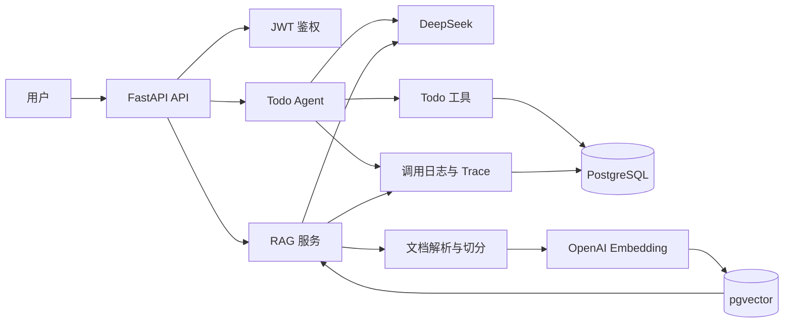

# WorkBrain

WorkBrain 是一个面向 AI Agent 开发岗位的后端项目。

项目基于 FastAPI、DeepSeek、OpenAI Embedding 和 PostgreSQL pgvector，实现了用户鉴权、Todo Agent、工具调用、文档知识库和 RAG 问答。

## 核心能力

### 后端基础

- 用户注册、登录和 JWT 鉴权
- PostgreSQL 数据持久化
- 用户数据权限隔离
- FastAPI 自动接口文档
- Docker Compose 启动 API 和数据库

### Todo Agent

- 使用 DeepSeek 判断是否需要调用工具
- 支持一次返回多个 `tool_calls`
- 支持创建、查询和完成 Todo
- 删除操作需要用户确认
- 保存工具调用日志和 Agent 执行轨迹
- 记录 Token 使用量和预估成本

### RAG 知识库

- 上传 TXT 和 Markdown 文档
- 提取文档文本
- 文本切分与处理预算限制
- 使用 OpenAI Embedding 生成向量
- 使用 PostgreSQL pgvector 检索
- 结合向量相似度和关键词匹配进行排序
- 根据相关度阈值拒绝无依据回答
- 返回回答引用来源
- 保存 RAG 查询和文档处理日志

## 技术栈

| 分类 | 技术 |
| --- | --- |
| Web 框架 | FastAPI |
| ORM | SQLModel |
| 数据库 | PostgreSQL |
| 向量数据库 | pgvector |
| 对话和 Agent | DeepSeek |
| Embedding | OpenAI Embedding |
| 身份认证 | JWT |
| 测试 | Pytest |
| 环境管理 | Docker Compose |

## 系统架构



## RAG 工作流程

```text
上传文档
  -> 提取文本
  -> 文本切分
  -> 生成 Embedding
  -> 保存 pgvector
  -> 用户提出问题
  -> 生成问题向量
  -> 数据库向量检索
  -> 关键词相关度过滤
  -> 低相关度拒答
  -> DeepSeek 根据检索内容生成回答
  -> 返回答案与引用来源
```

## 本地运行

### 1. 创建虚拟环境

```bash
python3 -m venv .venv
source .venv/bin/activate
```

### 2. 安装依赖

```bash
pip install -r requirements.txt
```

### 3. 配置环境变量

```bash
cp .env.example .env
```

在 `.env` 中配置：

```env
DEEPSEEK_API_KEY=你的_DeepSeek_Key
OPENAI_API_KEY=你的_OpenAI_Key
```

不要把真实密钥提交到 GitHub。

### 4. 使用 Docker Compose 启动完整服务

```bash
docker compose up --build -d
```

Docker Compose 会同时启动 PostgreSQL 和 FastAPI。查看服务状态：

```bash
docker compose ps
```

如需在宿主机调试 FastAPI，可以只启动数据库：

```bash
docker compose up -d postgres
uvicorn main:app --reload
```

接口文档：

```text
http://127.0.0.1:8000/docs
```

健康检查：

```text
GET http://127.0.0.1:8000/health
```

## 核心接口

| 接口 | 作用 |
| --- | --- |
| `POST /users/register` | 注册 |
| `POST /users/login` | 登录并获取 Token |
| `POST /assistant/tools` | 使用 Todo Agent |
| `POST /documents` | 上传文档 |
| `POST /documents/{id}/process` | 处理文档并生成向量 |
| `POST /rag/ask` | 知识库问答 |
| `GET /rag/logs` | 查询 RAG 日志 |
| `GET /assistant/traces` | 查询 Agent 执行轨迹 |

## 测试

运行普通回归测试：

```bash
.venv/bin/python -m pytest tests/test_regression_contract.py -q
```

运行 pgvector 集成测试：

```bash
.venv/bin/python -m pytest tests/test_pgvector_integration.py -q
```

运行全部测试前，需要确保 PostgreSQL 已启动：

```bash
docker compose up -d
.venv/bin/python -m pytest tests -q
```

普通测试使用 SQLite 和模拟模型调用，不产生 API 费用。pgvector 集成测试会连接本地 PostgreSQL，并在测试结束后回滚测试数据。

## 工程设计

- Agent 只能调用后端明确注册的工具
- 数据库查询始终检查当前用户，避免跨用户访问
- 危险操作不会由模型直接执行
- RAG 相关度不足时拒绝回答
- 文档处理设置字符数和分块数量上限
- 模型调用、工具执行和 RAG 查询都有日志
- PostgreSQL 使用 pgvector 执行向量距离计算

## 项目定位

该项目重点展示 AI 应用开发中的工程能力，而不是只演示模型 API：

- Agent 工具调用与执行循环
- 权限控制和危险操作确认
- RAG 检索、引用和拒答
- Token、成本和处理预算控制
- 日志、测试和故障定位
