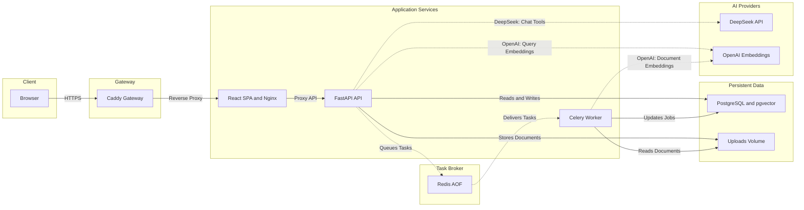
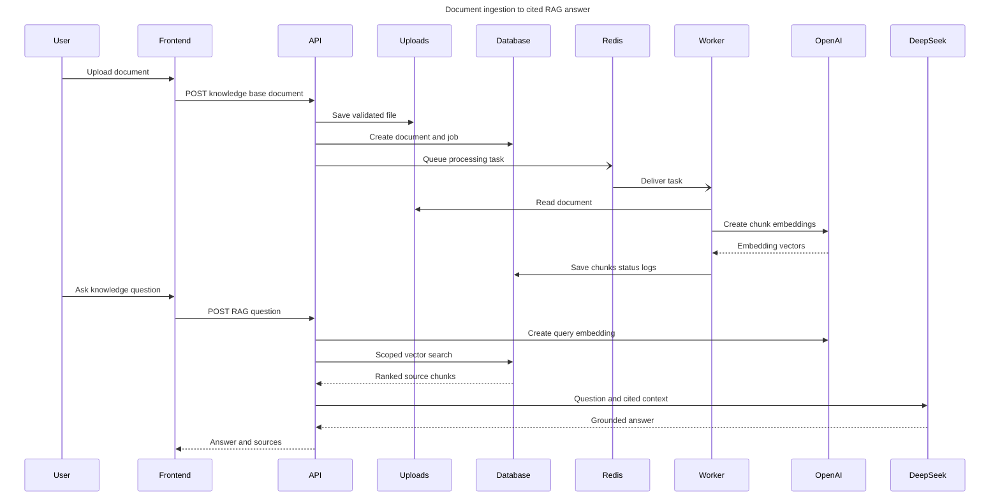
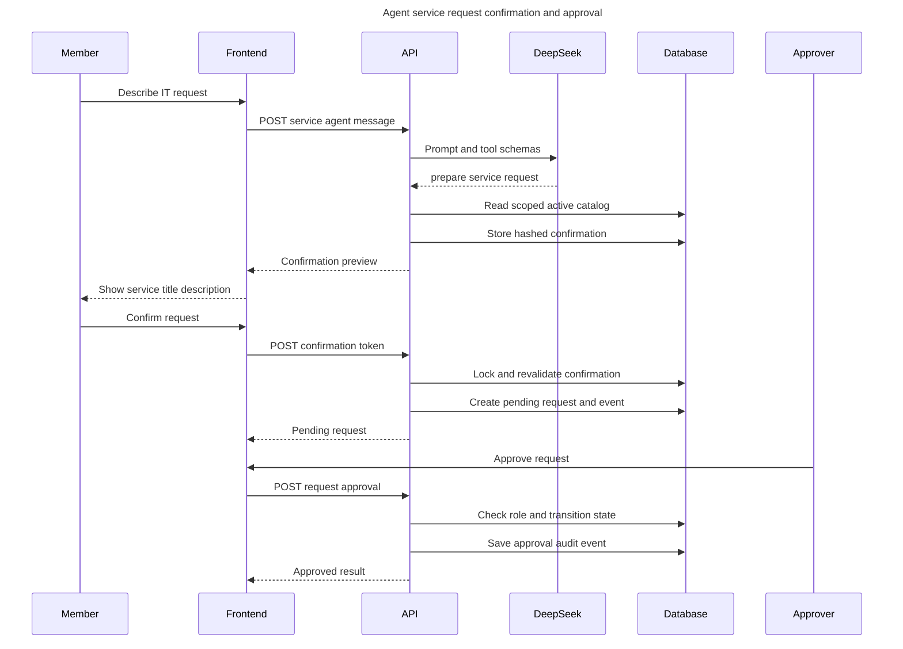

# WorkBrain 系统架构与核心数据流

本文档只描述仓库当前已经实现并经过测试的系统。可编辑版本保存在 [WorkBrain FigJam 架构板](https://www.figma.com/board/fF2aP8n862VyO7EXWZdQjR)。

## 生产系统架构

浏览器只访问 Caddy 公开的 80/443 端口。Caddy 把流量转发给包含 React 静态资源和 Nginx 反向代理的前端容器，Nginx 再把 `/api` 请求转发给 FastAPI。API 负责同步业务、JWT、组织权限、RAG 查询和 Agent 调度；Celery Worker 负责文档解析、切块和向量化。PostgreSQL 同时保存业务数据和 pgvector 向量，Redis AOF 作为 Celery Broker 和结果后端，上传文件保存在独立持久化卷中。

### 组件职责

| 组件 | 当前职责 |
| --- | --- |
| React + TypeScript | 登录、组织、知识库、文档、RAG、服务目录、申请、审批和 Agent 页面 |
| Caddy | 公开入口、域名和 HTTPS 终止 |
| Nginx | 托管 SPA，并把 `/api` 请求转发给后端 |
| FastAPI | JWT、组织上下文、RBAC、业务 API、RAG、Tool Calling、审计和健康检查 |
| Celery Worker | 原子领取后台任务，解析文档、切块、生成 Embedding、重试并写回状态 |
| PostgreSQL + pgvector | 业务关系数据、审计数据、任务状态和向量相似度检索 |
| Redis AOF | Celery Broker、任务结果后端和重启后的队列持久化 |
| Uploads Volume | 上传原始文件的持久化存储 |
| DeepSeek | 普通聊天、Todo Tool Calling 和 IT 服务申请意图识别 |
| OpenAI Embeddings | 文档片段和查询文本的向量生成 |

## 文档处理与 RAG 数据流

上传接口只负责安全校验、保存文件、创建任务记录并投递 Celery。Worker 使用数据库任务状态完成原子领取，处理成功后一次性保存正文、分块、向量和处理日志。RAG 查询只搜索当前 `organization_id` 和知识库中的已发布版本，随后进行 pgvector 候选检索、词法重排和最低分数过滤，再把带编号的资料交给 DeepSeek 生成答案。

### RAG 的可信边界

- 只检索已发布文档及其当前版本的已发布片段。
- 查询同时绑定 `organization_id` 和 `knowledge_base_id`，个人接口和企业知识库接口相互隔离。
- pgvector 先取得语义候选，再结合词法覆盖率重排。
- 低于阈值或词法证据不足时不调用答案模型，直接拒答。
- 每个来源返回引用编号、文档编号、片段编号、得分和预览。
- 每次企业 RAG 查询记录来源片段、是否调用 LLM、延迟和命中数量。
- 固定评测集持续检查 Recall@K、MRR、拒答准确率和参数组合。

## Agent 创建申请与审批数据流

DeepSeek 只能选择工具，不能直接写入 ServiceRequest。准备工具先在当前组织中解析启用的服务目录，缺少字段时返回候选项；字段完整时创建短期确认记录。确认令牌只保存哈希，明文只返回给当前用户。用户确认后，后端锁定确认记录，重新校验用户、组织和服务状态，再创建 pending 申请和审计事件。

### 申请状态与权限

- 申请状态只允许 `pending`、`approved`、`rejected`。
- 角色为 `member / approver / admin`，普通成员不能审批。
- 申请人不能审批自己的申请。
- 拒绝必须填写原因，已结束申请不能重复审批。
- 确认时再次校验服务项目仍属于当前组织且仍然启用。
- 确认记录使用行锁和已消费状态实现幂等，重复确认返回原申请。
- 创建、批准和拒绝都记录操作者、原状态、新状态、原因和时间。
- Tool Call 和 Agent Trace 保存组织范围，日志中的确认令牌会被替换为 `[REDACTED]`。

## 可靠性与部署边界

- 文档任务在数据库中原子领取，避免多个 Worker 重复执行同一个任务。
- 临时错误按指数退避重试，最终失败记录安全错误信息和处理日志。
- PostgreSQL、Redis 和上传文件使用独立 Docker Volume。
- Redis 开启 AOF，Worker 停止期间的已排队任务可以在恢复后继续执行。
- Alembic 迁移成功后 API 和 Worker 才启动。
- API 和 Worker 以非 root 用户运行。
- 生产编排仅公开 80/443，数据库、Redis 和 API 端口不直接暴露。
- liveness、readiness、Worker ping、前端和 Gateway 都有健康检查。
- 生产冒烟脚本覆盖注册、组织、知识库、服务目录、申请、审批、审计和后台任务。

## 可用于简历和面试的技术亮点

1. 实现组织级多租户权限模型，把用户身份、当前组织和 member / approver / admin 角色统一注入业务接口，并以查询条件和权限策略共同保证跨组织隔离。
2. 设计异步文档处理流水线，将上传和解析解耦，使用 Celery、Redis AOF、数据库任务状态、原子领取、指数退避和幂等处理提高故障恢复能力。
3. 基于 PostgreSQL pgvector 实现企业 RAG，在语义检索后增加词法证据过滤、文档发布版本约束、引用来源和资料不足拒答，并建立固定评测集验证参数。
4. 使用原生 Tool Calling 实现 Todo 与 IT 服务申请 Agent，对有副作用操作增加服务端确认令牌、过期时间、行锁、二次权限校验和审计事件，避免模型伪造确认。
5. 完成 React 前端和生产 Docker 编排，通过 Caddy、Nginx、健康检查、自动迁移、非 root 容器和持久化卷形成可部署的端到端产品。

## 非生产实验边界

第 71 天增加的 MCP Demo 不属于生产运行架构。它位于 `experiments/`，只通过 stdio 暴露固定组织的启用服务目录，不接入现有 API、Docker Compose 或生产 Agent。
